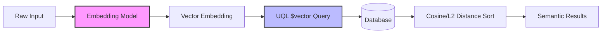

import { CardGrid, LinkCard } from '@astrojs/starlight/components';

## Build semantic search without extra complexity

With UQL, semantic search is part of your normal ORM workflow. You can store embeddings and query by meaning without adding a separate search stack.



- **Multi-runtime support**: Optimized for Node.js, **Bun Native**, Deno, and the Browser.
- **Multi-database support**: PostgreSQL (pgvector), CockroachDB, MySQL (v8.0.39+ / v9.0.1+), MariaDB (v11.4+), SQLite (sqlite-vec), and MongoDB Atlas.
- **One query shape end-to-end**: Use the same JSON query structure on backend and frontend.

---

## End-to-end example

### 1. Define an entity with a vector field

```ts
import { Entity, Id, Field, Index } from 'uql-orm';

@Entity()
@Index(['embedding'], { type: 'hnsw', distance: 'cosine', m: 16, efConstruction: 64 })
export class Article {
  @Id() id?: number;
  @Field() title?: string;
  @Field() category?: string;

  @Field({ type: 'vector', dimensions: 1536 })
  embedding?: number[];
}
```

### 2. Ingest content with embeddings

For single-operation scopes, prefer [`pool.withQuerier()`](/querying/querier).

```ts
import { pool } from './uql.config.js';
import { Article } from './entities.js';

const embedding = await embed('What is UQL?'); // any embedding model

await pool.withQuerier((querier) =>
  querier.insertOne(Article, {
    title: 'What is UQL?',
    category: 'docs',
    embedding,
  })
);
```

### 3. Query by meaning

```ts
import type { WithDistance } from 'uql-orm';
import { pool } from './uql.config.js';
import { Article } from './entities.js';

const queryEmbedding = await embed('TypeScript ORM with vector search'); // any embedding model

const results = await pool.withQuerier((querier) =>
  querier.findMany(Article, {
    $where: { category: 'docs' },
    $sort: {
      embedding: {
        $vector: queryEmbedding,
        $distance: 'cosine',
        $project: 'similarity',
      },
    },
    $limit: 10,
  })
) as WithDistance<Article, 'similarity'>[];

for (const article of results) {
  console.log(article.title, article.similarity);
}
```

`$project` adds the computed score to each row (here: `similarity`), so your app can filter, rank, or inspect relevance.

The query shape stays the same across all SQL dialects (PostgreSQL, CockroachDB, MySQL, MariaDB, SQLite) and MongoDB Atlas.

---

## Fullstack semantic search

UQL queries are plain JSON, so backend and frontend may share the same query format (optional).

```ts
// api.ts (Express)
import express from 'express';
import { querierMiddleware } from 'uql-orm/express';
import { Article } from './entities.js';

const app = express();
app.use('/api', querierMiddleware({ include: [Article] }));

// client.ts (Browser)
import { HttpQuerier } from 'uql-orm/browser';
import { Article } from './entities.js';

const queryEmbedding = await embed('semantic query from user input'); // any embedding model
const http = new HttpQuerier('/api');

const results = await http.findMany(Article, {
  $where: { category: 'science' },
  $sort: { embedding: { $vector: queryEmbedding } },
  $limit: 5,
});
```

---

## Production tips

### Hybrid retrieval (metadata + vectors)

In production, combine normal filters with vector ranking so results stay relevant to user context.

```ts
import type { WithDistance } from 'uql-orm';

const queryEmbedding = await embed(userQuery);

const candidates = await pool.withQuerier((querier) =>
  querier.findMany(Article, {
    $where: {
      category: 'docs',
    },
    $sort: {
      embedding: {
        $vector: queryEmbedding,
        $distance: 'cosine',
        $project: 'score',
      },
    },
    $limit: 30,
  })
) as WithDistance<Article, 'score'>[];
```

### Score thresholding

Keep low-signal results out of your RAG context window:

```ts
const filtered = candidates.filter((row) => row.score <= 0.35);
```

With cosine distance, lower values are better matches. Tune this threshold from real logs and user feedback.

---

## Learn more

<CardGrid>
  <LinkCard
    title="Semantic Search Reference"
    href="/querying/semantic-search"
    description="All operators and options for vector fields, distance metrics, and indexes."
  />
  <LinkCard
    title="Querying"
    href="/querying/querier"
    description="Deep selection, filtering, relation operators, and streaming."
  />
</CardGrid>
