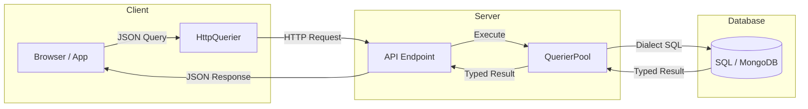

import { CardGrid, LinkCard } from '@astrojs/starlight/components';

```sh
npm install uql-orm
```

---

## What makes UQL different

A UQL query is a plain JSON object — the same data you can log, cache, send over HTTP, or hand to the browser, with full TypeScript inference at every depth. That one decision shapes everything else:



- **Queries are data, not method chains.** Build them dynamically, store them, diff them, or send them straight from the client. There's no DSL to learn and nothing to compile.
- **No codegen, no build step.** Entities are TypeScript classes, so your code *is* the schema. There's no `.prisma` file to regenerate and no generated client to keep in sync.
- **One API everywhere.** The same syntax runs on PostgreSQL, MySQL, MariaDB, SQLite, LibSQL, Neon, Cloudflare D1, MongoDB, and Bun's native SQL.
- **Fast by design.** Fastest in [all 8 categories](/comparison#performance) of our [open benchmark](https://github.com/rogerpadilla/ts-orm-benchmark): on average ~2.4× faster than the runner-up, reaching 3.9M ops/s on simple SELECTs.

Open source · Used in production by [Variability.ai](https://variability.ai).
