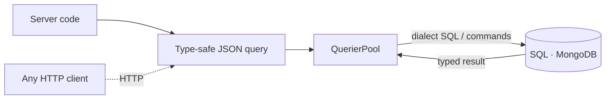

import { CardGrid, LinkCard } from '@astrojs/starlight/components';

```sh
npm install uql-orm
```

---

## What makes UQL the perfectionist ORM

Most ORMs make you choose: lean and fast, or full-featured and heavy. UQL is designed so you don't have to. A UQL query is a plain JSON object, the same data you can log, cache, send over HTTP, or hand to the browser, with full TypeScript inference at every depth. That one decision makes it both the [fastest](https://rogerpadilla.github.io/ts-orm-benchmark/chart.html) ORM in our benchmark and the most capable, with no codegen and no build step. It shapes everything else:



- **Queries are data, not method chains.** Build them dynamically, store them, diff them, or send them straight from the browser, mobile or micro-service. There's no DSL to learn and nothing to compile.
- **No codegen, no build step.** Entities are TypeScript classes, so your code *is* the schema. There's no `.prisma` file to regenerate and no generated client to keep in sync.
- **One API everywhere.** The same syntax runs on PostgreSQL, CockroachDB, MySQL, MariaDB, SQLite, LibSQL, Neon, Cloudflare D1, MongoDB, and Bun's native SQL.
- **[The fastest SQL generator!](https://rogerpadilla.github.io/ts-orm-benchmark/chart.html) in all the [ 8 categories](/benchmark) of our open-source [benchmark](https://github.com/rogerpadilla/ts-orm-benchmark), even vs. query builders.** In all 8 categories: ~2.1× faster on average than the runner-up, quicker than raw builders like Knex and Kysely, reaching over 3.9M ops/s on simple SELECTs.
- **The hard things, built in.** [Native semantic and vector search](/ai-semantic-search), [non-bypassable multi-tenant security filters](/multi-tenancy), [soft-delete with restore](/entities/soft-delete), and [entity-first migrations](/migrations): capabilities that mean raw SQL, a plugin, or "not supported" in other ORMs. And when you want them, an optional [REST API](/extensions-http) and [typed browser client](/extensions-browser) ship in the same package, no extra dependency.

Open source · Used in production by [Variability.ai](https://variability.ai).
